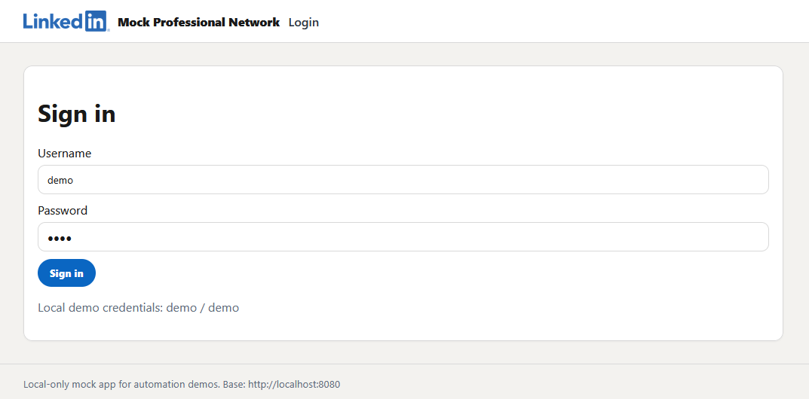
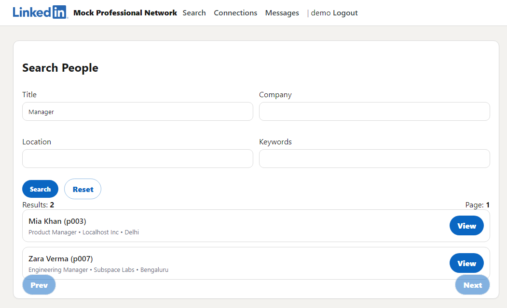
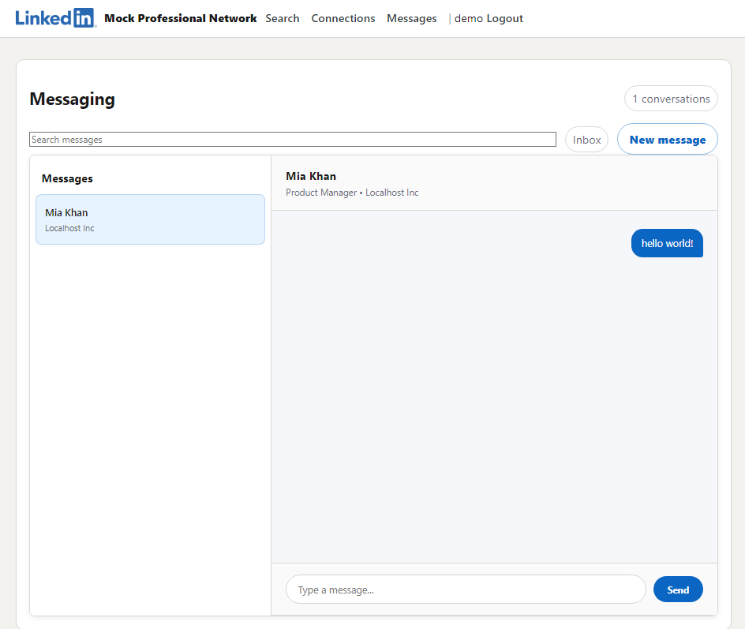
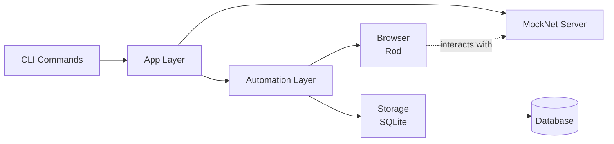
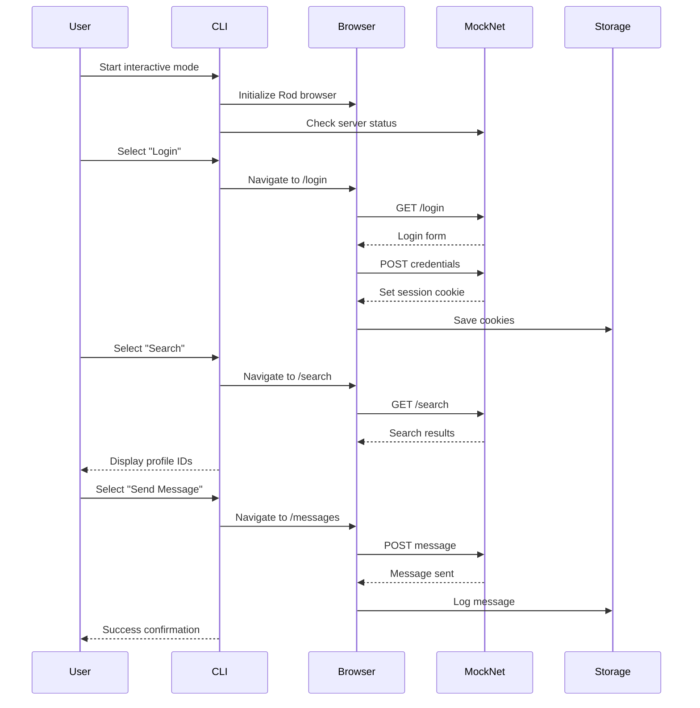

# Subspace Assignment — Browser Automation (MockNet)

[](https://github.com/aywhoosh/subspace-assignment-ayush/actions/workflows/ci.yml)
[](go.mod)

Educational proof-of-concept demonstrating **robust browser automation** and **clean architecture** in Go using **Rod**, against a **local mock social network** shipped with this repository.

## What this is / isn’t

- ✅ A local-only automation demo with resilient patterns (timeouts, state persistence, logging)
- ✅ A safe, controlled environment: `mocknet` runs at `http://localhost:8080`
- ❌ Not for automating real third‑party websites/services
- ❌ Not a bot‑evasion project (no fingerprint masking, webdriver flag tampering, CAPTCHA/2FA bypass)

## Screenshots

### MockNet Login


### Interactive CLI Menu


### Search Results


### Send Message


## Quick start (Windows)

### 1) Start MockNet (required)

PowerShell:

```powershell
Start-Job -ScriptBlock { go run ./cmd/subspace-assignment mocknet up }
Start-Sleep 2
```

Open:

- `http://localhost:8080/login`

### 2) Run the interactive demo (recommended)

```powershell
go run ./cmd/subspace-assignment interactive
```

The menu supports:

- Login
- Search (shows profile IDs)
- Send connection request
- Send message
- Check session status
- View inbox

### 3) Run individual automations

```powershell
go run ./cmd/subspace-assignment automate doctor
go run ./cmd/subspace-assignment automate login
go run ./cmd/subspace-assignment automate check
```

### 4) Stop server and clean up

```powershell
Get-Job | Stop-Job
Get-Job | Remove-Job

# If a browser was left open:
Stop-Process -Name msedge -Force -ErrorAction SilentlyContinue
Stop-Process -Name chrome -Force -ErrorAction SilentlyContinue
```

More command snippets: see `commands.txt`.

## Configuration

- Copy `config.example.yaml` → `config.yaml`
- Storage:
    - YAML: `storage.sqlite_path`
    - Env: `SUBSPACE_STORAGE_SQLITE_PATH`

### Browser selection (Windows)

This project prefers a system-installed browser (Edge/Chrome). If auto-detection fails:

```powershell
$env:SUBSPACE_BROWSER__BIN_PATH="C:\Program Files (x86)\Microsoft\Edge\Application\msedge.exe"
```

If your machine blocks Rod’s helper, keep `SUBSPACE_BROWSER__LEAKLESS=false` (default).

## Features implemented

- Configuration (YAML + env overrides)
- Structured logging (`slog`)
- SQLite storage + migrations
- MockNet server with stable selectors
- Rod browser client + cookie persistence
- Workflows: auth, session check, search/profile view, connect, messaging
- Human-like behavior: delays + typing speed
- Unit tests (`go test ./...`)

## Architecture



**Key components:**

- **CLI** — Interactive mode & automation commands
- **App** — Orchestrates workflows
- **Automation** — Auth, search, connect, message workflows
- **Browser** — Rod wrapper with cookie persistence
- **Storage** — SQLite repositories & migrations
- **MockNet** — Local social network server

## API surface (developer reference)

### Search

```go
type SearchOptions struct {
	Title    string
	Company  string
	Location string
	Keywords string
	PerPage  int
}

func Search(ctx, br, baseURL, opts) ([]SearchResult, error)
func ViewProfile(ctx, br, baseURL, profileID) (string, error)
```

### Connections

```go
func SendConnectionRequest(ctx, br, baseURL, profileID, note) error
func GetPendingRequests(ctx, br, baseURL) ([]string, error)
```

### Messaging

```go
type Message struct {
	From      string
	Content   string
	Timestamp string
}

func SendMessage(ctx, br, baseURL, recipientID, messageText) error
func GetConversation(ctx, br, baseURL, recipientID) ([]Message, error)
func GetInbox(ctx, br, baseURL) ([]string, error)
```

## Testing

```powershell
go test ./...
```

## Troubleshooting

### Browser setup

```powershell
go run ./cmd/subspace-assignment automate doctor
```

### Clear local state (fresh run)

PowerShell:

```powershell
Remove-Item -Path .\data\subspace.db -Force -ErrorAction SilentlyContinue
```

## Safety / ethics

- Automation targets **only** the included local MockNet app.
- Checkpoint pages are handled via **detection + safe pause** (no bypass logic).

## Links

- Quick command reference: `commands.txt`
- Rod docs: https://go-rod.github.io/

---

## Automation Workflow



This diagram shows the typical flow when using the interactive mode to login, search for profiles, and send messages through the automated browser.
